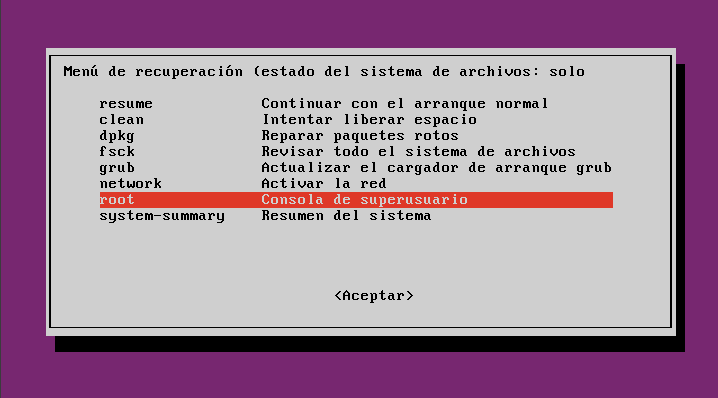
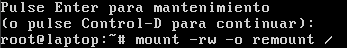
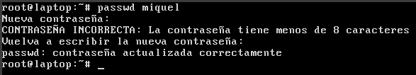
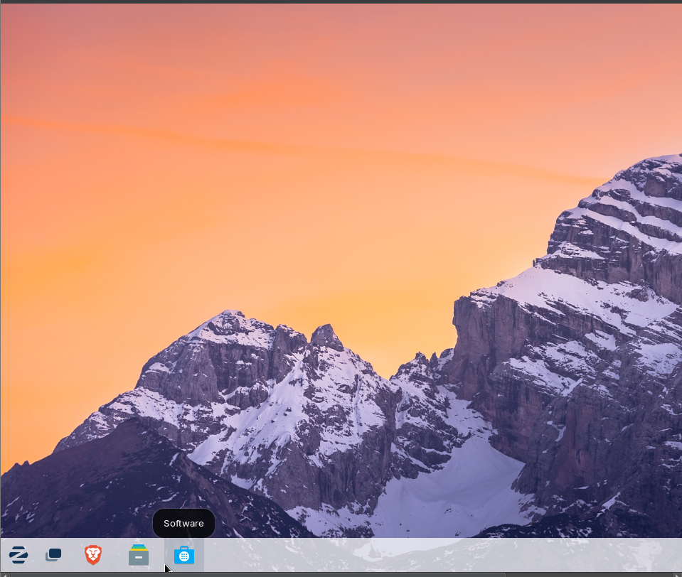
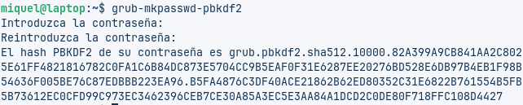
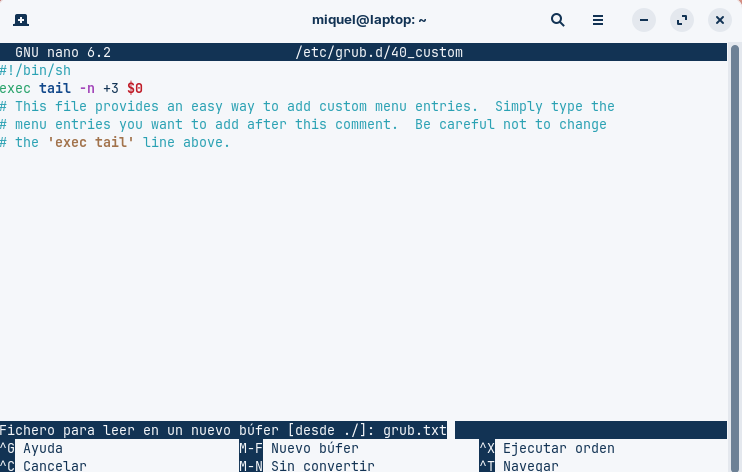
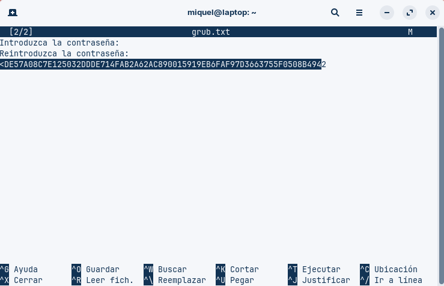
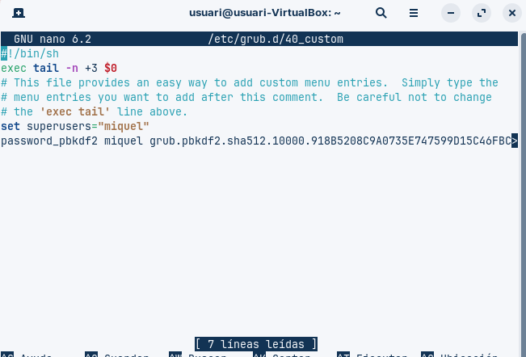
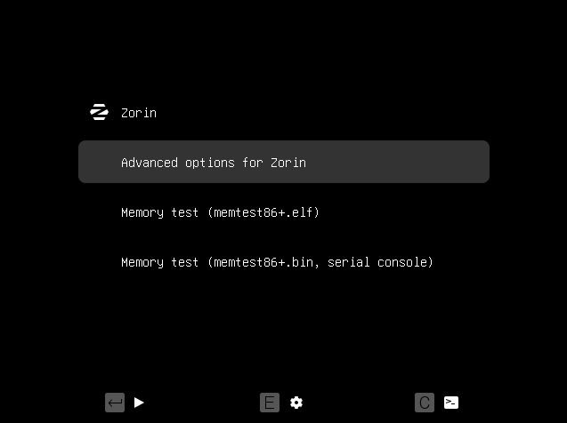

 

#### 

- Per entrar al mode **GRUB**, premerem la tecla **Shift** i qualsevol altra tecla mentre s’inicia la màquina.Un cop aparegui el menú, seleccionarem l’opció **Advanced options for Zorin**.

- Quan siguem dins, escollirem **Zorin (recovery mode)**.  
  (se me olvido la foto)  
- A continuació, se’ns mostrarà el menú de recuperació, on triarem l’opció **root**.  
 
- Executarem la següent comanda per muntar el disc i poder editar arxius:  
  `mount -rw -o remount /`  
  
- Després, canviarem la contrasenya de l’usuari amb la comanda següent:  
  `passwd miquel`  
 
- Un cop feta la modificació, reiniciarem el sistema. En tornar a iniciar, ja podrem entrar amb la nova contrasenya.  
  
- A la terminal, escriurem la comanda següent `grub-mkpasswd-pbkdf2` Aquesta comanda generarà un hash per a la contrasenya que indiquem. Com que no volem escriure tot el hash manualment, podem utilitzar la comanda tee per desar-lo en un fitxer  
  `grub-mkpasswd-pbkdf2 | tee hash.txt`  
    
  
- Ara editarem l’arxiu `/etc/grub.d/40_custom` amb:  
  `sudo nano -F /etc/grub.d/40_custom`  
   
- Dins de *nano*, premerem **Ctrl \+ R** per obrir el fitxer on tenim el hash.  
    
- Quan aparegui, ens situarem on comença el hash, premerem **Alt \+ A** per començar a seleccionar i marcarem tot el contingut. Després, premerem **Alt \+ 6** per copiar-lo. Tanquem l’arxiu amb **Ctrl \+ X**.  
    
- A continuació, escriurem aquestes dues línies dins del fitxer `40_custom`  
  `set superusers="nom_usuari"`  
  `password_pbkdf2 nom_usuari hash`  
  A la primera línia hi posarem el nom de l’usuari, i a la segona escriurem el nom de l'usuari i enganxarem el hash copiat anteriorment amb **Ctrl \+ U**.  
  Guardarem i tancarem el fitxer.  
  
- Finalment, aplicarem els canvis amb la comanda:  
  `sudo grub-mkconfig -o /boot/grub/grub.cfg`  
    
- Ara, quan tornem a entrar al **recovery mode**, després de seleccionar *Advanced options for Zorin*, el sistema ens demanarà un usuari.  
    
- A més, en engegar la màquina, també se’ns sol·licitarà usuari i contrasenya per accedir.  
  

R
